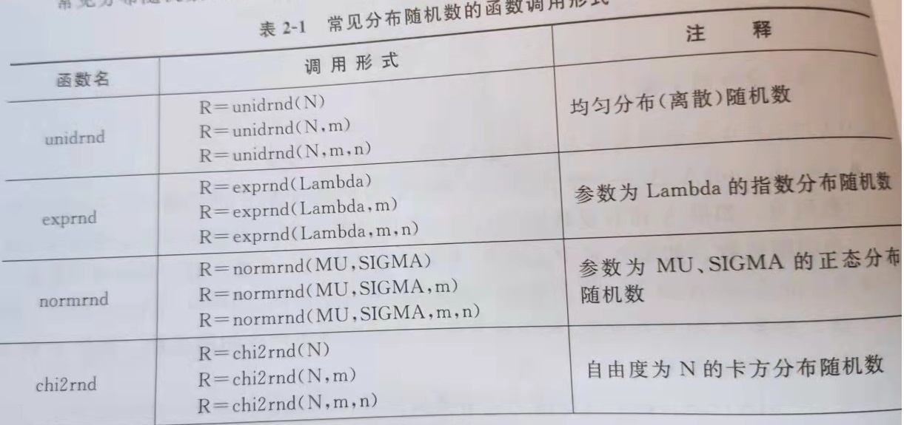

# 数学建模基础

数学研究**数量关系**和**空间形式**

- 需求

> 定量分析和研究
> 问题的实际背景
> 明确目的

- 收集信息

- 简化假设

> 突出主次 -> 对所有因素一概考虑, 未着眼当前问题, 抓住本质

- 分析内在规律

> 利用合适的数学工具,刻画内在规律,表现为一种数学结构

- 符号化

- 建立模型

- 模型求解

> 计算的本质利用出数据的价值

- 检验模型


## 数据导入


导入之前可以查看文件内容

whos -file  filename

```

load  //默认是 matlab.mat

load filename //导入 filename 的所有变量

load filename X Y Z // 导入 filename 的指定变量 X Y Z

load filename-regexp expr1 expr2 // 导入 filename 的 expr1 expr2(正则表达式描述)

load-ascii filename // 以 ascii 格式导入

load-mat filename // 以 mat 格式导入


A = importdata('filename'[, 'delimiter']); //将 filename 中的数据导入工作区
// delimiter 指定的符合作为分隔符
// 导入保存为 A, A为结构体

```


## 数据保存

```
save  //所有变量保存为 matlab.mat

save('filename') // filename 可以包含路径,若不然则是当前路径

save('filename', 'var1', 'var2', ...)

save('filename', '-struct', 's') //保存结构体 s 中所有的域作为变量

save('filename', '-struct', 's', 'f1', 'f2') //保存结构体 s 中指定的域 作为变量

save('-regexp', expr1, expr2) // 通过正则表达式来保存变量

```

## 文件打开

open('filename') //将变量临时打开在工作区,以 ans 作为命名, 也可以赋值

## 数据统计

平均值

mean(A[, dim]) // dim 表示维度方向

nanmean //忽略 NaN 的 平均值


中位数

median

nanmedian

方差

var(A, w, dim) // w为权重 (即前面系数为 1/n,默认如此)

标准差

std(A, flag, dim)   //flag = 0 表示为修正标准差(即前面系数为 1/n,默认如此)

nanstd


偏度和偏度 Jarque-Bera 检验

判断是否接近正态分布

正态分布 偏度为0 峰度接近 3

[jbtest](https://www.mathworks.com/help/stats/jbtest.html#btv1pfp-p)(X[, alpha]) = [H, P, JBSTAT, CV] 

alpha 置信水平  ---0.05

H   1 为拒绝 0为接受

JBSTAT ...

二项分布

binornd(N, P, m)  //m及以后就是每个维度指定的大小

```

clear all
clc
x=binornd(10,0.45,100000,1);
hist(x,11);

```

泊松分布

poisspdf(x, Lambda)

```matlab
clear all
clc
x=0:20;
y1=poisspdf(x,2.5);
y2=poisspdf(x,5);
y3=poisspdf(x,10);
hold on
plot(x,y1,':r*')
plot(x,y2,':b*')
plot(x,y3,':g*')
hold off
```

均匀分布

unifrnd

正态分布

normrnd

<details><summary> 概述 </summary>




</details>


参数估计

[假设检验](https://blog.csdn.net/colddie/article/details/7773278)

方差已知时的均值假设假设检验

ztest(x = sample, m = assumeXmean, alpha = assumeAlpha, tail={0/'both',1/'right',-1/'left'}) //tail 表明正态分布峰值的两侧还是单侧

正态总体均值假设检验

方差未知    t 检验


```matlab
clear all
clc
x1=[59.6 55.2 56.6 55.8 60.2 57.4 59.8 56.0 55.8 57.4];
x2=[56.8 54.4 59.0 57.0 56.0 60.0 58.2 59.6 59.2 53.8];
x=[x1 x2]';
a=0.05;
[muhat,sigmahat,muci,sigmaci]=normfit(x,a);
[p,ci]=mle('norm',x,a);     %最大似然估计 Maximum likelihood estimates
n=numel(x); %number of element
format long
muhat
p1=p(1)
sigmahat
sigmahat1=var(x).^0.5
p2=p(2)
muci
ci
sigmaci
muci1=[muhat-tinv(1-a/2,n-1)*sigmahat/sqrt(n),muhat+tinv(1-a/2,n-1)*sigmahat/sqrt(n)]
sigmaci1=[((n-1).*sigmahat.^2/chi2inv(1-a/2,n-1)).^0.5,((n-1).*sigmahat.^2/chi2inv(a/2,n-1)).^0.5]
```

[tinv](https://www.mathworks.com/help/stats/tinv.html)

[chi2inv](https://www.mathworks.com/help/stats/chi2inv.html)


当方差已知时，用 ztest

当方差未知时，需要判定某个期望的相对关系，用 ttest

当方差未知时，需要比较的也是一个类似的正态分布，用 ttest2


方差分析

anova1

anova2


## 绘图

[tabulate](https://www.mathworks.com/help/stats/tabulate.html)(A)  //绘制频率图

cdfplot  //经验积累分布函数图形

[lsline](https://www.mathworks.com/help/stats/lsline.html)  //最小二乘拟合直线

normplot //正态概率图形

weibplot //威布尔概率图形

boxplot //盒图

refline  //增加参考线

refcurve //增加多项式曲线

capaplot //增加概率图形

histfit

normspec


## 回归模型

1. 预测

2. 发现变量之间的数学关系

3. 对于确定的数学关系式的可信程度进行统计检验，并且区分出对某一特定变量影响是否显著

ployfit(x, y, n) //n  Degree of polynomial fit


regress //多元线性回归

```matlab
clear all
clc 
x1=[1.376, 1.375, 1.387, 1.401, 1.412, 1.428, 1.445, 1.477];
x2=[0.450,0.475,0.485,0.500,0.535,0.545,0.550,0.575];
x3=[2.170,2.554,2.676,2.713,2.823,3.088,3.122,3.262];
x4=[0.8922, 1.1610,0.5346,0.9589, 1.0239, 1.0499,1.1065, 1.1387];
y=[5.19, 5.30,5.60,5.82,6.00,6.06,6.45,6.95];

Y=[y'];
x=[ones(size(x1')),x1',x2',x3',x4'];
% x=[ones(size(x1')),x1',x2',x3',x4'];
[b,bint,r,rint,stats]=regress(Y,x)
```